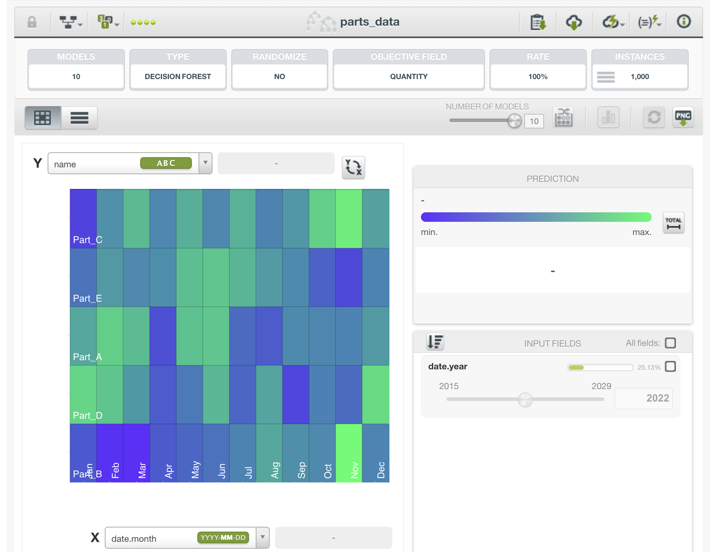
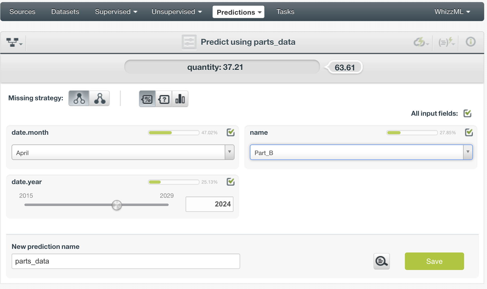
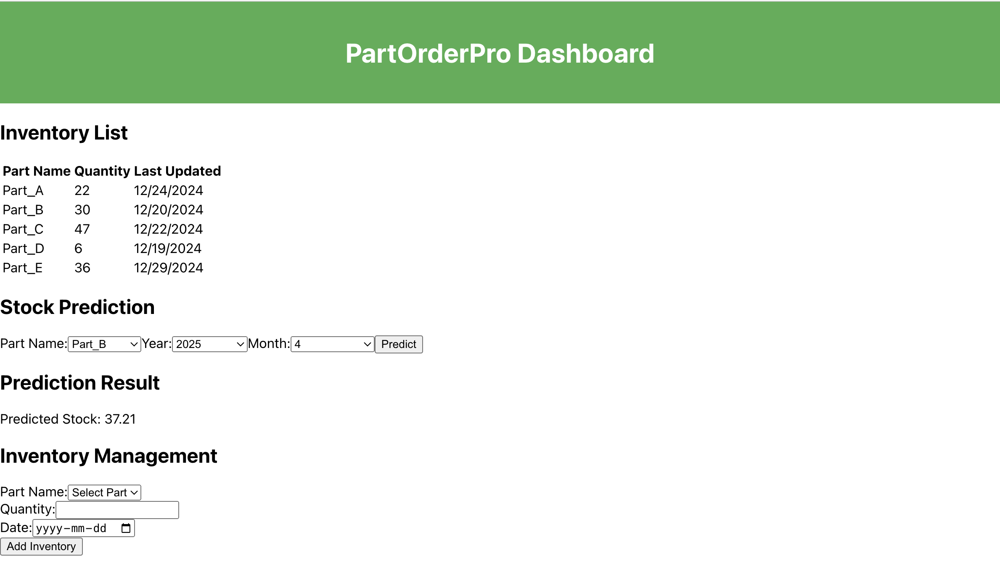

# PartOrderPro
### デモアプリ説明ドキュメント

#### 1. 課題設定

製造業における部品発注と在庫管理の非効率性が生産性を低下させる一因となっています。Perplexityを使用して最新の業界動向と課題を把握した結果、以下の課題が明らかになりました：

- **在庫管理の煩雑さ**: 物品が常に変動しているため、在庫の管理が難しく、過剰発注や不足が生じやすい。
- **発注ミスによる生産遅延**: 在庫予測が不十分な場合、発注ミスが発生し、結果として生産の遅延を引き起こす可能性が高くなります。

（参照: 大塚商会「受発注システムによる効率化の方法」https://www.mdsol.co.jp/column/column_120_1857.html　）

#### 2. 解決策

このアプリ「**PartOrderPro**」は、**AIによる在庫管理と予測**をし、製造業の部品発注や在庫管理を効率化します。主な特徴としては以下の点が挙げられます：

- **AIによる在庫予測**: AIを活用して、将来の在庫を予測し、過剰発注や不足を防ぎます。
- **在庫管理の簡素化**: ユーザーが簡単に在庫アイテムを追加・管理できるインターフェースを提供。

#### 3. 技術スタックと簡単な設計

- **フロントエンド**: React.js
- **バックエンド**: Node.js, Express
- **データベース**: MongoDB
- **AIツール**: BigML (AIモデルのトレーニングと予測)

#### 4. デモの内容

このアプリでは、ユーザーが部品の在庫情報を管理し、AIを使って在庫予測を行うことができます。デモでは以下の機能があります：

- **在庫リスト表示**: 最新の在庫アイテムを一覧で表示。
- **在庫予測**: 部品名、年、月を入力して、AIによる予測された在庫量を表示。
- **在庫管理**: 新しい在庫アイテムを追加することができます。

BigMLに、１０００個のデータをアップロードしました。また、在庫予測を行うために、どのモデルを使用すればよいかを調べた結果、Ensembleモデルを使うことにしました。

バックエンドでは、指定された年月に基づいて予測データを取得するためにパラメーターを送信し、フロントエンドでその予測結果を表示します。



#### 5. 動かし方

1. プロジェクトのリポジトリをクローンします。

2. 必要なパッケージをインストールします。
   ```bash
   npm install
   ```

3. 環境変数を設定します。

    クライアントサイド：
- `REACT_APP_API_URL`: APIのURL
- `REACT_APP_BIGML_MODEL_ID`: BigMLモデルのID

    サーバーサイド：
- `DB_CONNECTION_STRING`: MongoDBの接続文字列
- `PORT`: サーバーのポート番号
- `BIGML_USERNAME`: BigMLのユーザーネーム
- `BIGML_API_KEY`: BigMLのAPIキー
- `BIGML_API_URL`: BigMLのAPIのURL

4. バックエンドサーバーを起動します。
   ```bash
   cd backend
   npm run dev
   ```

5. 別のターミナルでフロントエンド開発サーバーを起動します。
   ```bash
   cd client
   npm run start
   ```

6. ブラウザで `http://localhost:3000` にアクセスして、アプリを実行します。

#### 6. ToDo

- **予測精度の向上**: AIモデルの精度向上に向けて、追加データの収集とトレーニングが必要です。
- **リアルタイム予測更新**: 新しい在庫データが追加された際に、予測モデルに反映させる機能の実装。

#### 7. その他

- **実際の開発工数**: APIやUIの構築とAI統合には約2週間を要しました。
- **問題点**: AIモデルのトレーニングに必要な数学的な知識が私自身不足しているため、BIGMLの評価指標が示す数値が良いのか悪いのかを判断することができません。このため、予測の精度向上には、データ収集だけでなく、モデル調整についても深い理解と学習が必要。

#### 8. AI活用ポイント

**AIを活用した部分**:
- **在庫予測**: AIモデル（BigML）を使って、過去の在庫データを基に将来の需要を予測し、発注ミスを防ぎます。

**使用したAIツール**:
- **Perplexity**:課題設定。

- **BigML**: 機械学習プラットフォームを利用して、予測モデルを作成。BigMLを用いた予測モデルは、在庫の過去のデータを基に在庫を予測します。

- **ChatGPT**: データの生成（1000個のサンプルデータを作成）。BigMLでどのモデルを使用して予測するか。

- **GitHub Copilot**: JSDOCSと基本的な関数の生成に活用。

**AI活用ポイント**:
- 在庫予測ができることによって、製造業者が必要な部品を過剰に発注することなく、効率的に在庫を管理できるようになります。AIによる予測は、発注ミスを防ぎ、生産遅延のリスクを軽減します。